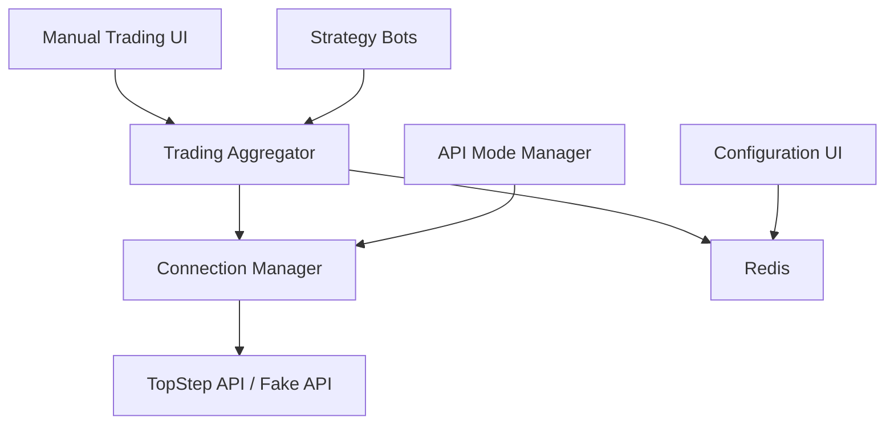

# TSX Trading Bot V4 - Complete Setup Guide

## 🎯 Overview

This comprehensive guide covers the complete setup, configuration, and operation of the TSX Trading Bot V4 system. This guide assumes you've already completed the [Fake API Quick Start Guide](FAKE-API-QUICK-START-GUIDE.md) and verified everything works in test mode.

## 📋 Table of Contents

1. [Prerequisites & Dependencies](#prerequisites--dependencies)
2. [Installation & Setup](#installation--setup)
3. [Configuration](#configuration)
4. [Service Architecture](#service-architecture)
5. [Startup Sequence](#startup-sequence)
6. [Web Interfaces](#web-interfaces)
7. [Trading Operations](#trading-operations)
8. [Risk Management](#risk-management)
9. [Strategy Configuration](#strategy-configuration)
10. [Monitoring & Alerts](#monitoring--alerts)
11. [API Mode Switching](#api-mode-switching)
12. [Troubleshooting](#troubleshooting)
13. [Production Deployment](#production-deployment)

---

## 📋 Prerequisites & Dependencies

### System Requirements
```yaml
Operating System: Windows 10/11 or Windows Server 2019+
Memory: 8GB RAM minimum (16GB recommended)
Storage: 10GB free space minimum
CPU: 4 cores minimum (8 cores recommended for multiple strategies)
Network: Stable internet connection (low latency preferred)
```

### Required Software

#### Node.js (v18.0.0 or higher)
```bash
# Download from: https://nodejs.org/
# Verify installation:
node --version
npm --version

# Should output:
# v18.x.x or higher
# 8.x.x or higher
```

#### Redis Server (v6.0.0 or higher)
```bash
# Option 1: Windows Native (Recommended)
# Download from: https://github.com/tporadowski/redis/releases
# Install and start as Windows service

# Option 2: Docker
docker run -d --name redis -p 6379:6379 redis:latest

# Option 3: WSL (Windows Subsystem for Linux)
wsl --install
# Then install Redis in WSL

# Verify Redis is running:
redis-cli ping
# Should return: PONG
```

#### Git (for version control)
```bash
# Download from: https://git-scm.com/download/win
# Verify installation:
git --version
```

#### Visual Studio Code (Recommended IDE)
```bash
# Download from: https://code.visualstudio.com/
# Recommended extensions:
# - JavaScript (ES6) code snippets
# - Node.js Modules Intellisense
# - REST Client
# - YAML
```

### Trading Account Prerequisites

#### TopStep Trading Account
- Valid TopStep trading account with API access
- API credentials (username and API key)
- Account must be funded and approved for trading
- Understand your account's risk limits and trading permissions

#### Network Requirements
- Stable internet connection (recommended: <50ms latency to Chicago)
- Firewall configuration to allow outbound connections to TopStep
- Windows Defender or antivirus configured to allow Node.js applications

---

## 🛠️ Installation & Setup

### Step 1: Clone Repository
```bash
# Navigate to your projects directory
cd C:\Users\[your-username]\Projects

# Clone the repository
git clone [repository-url] TSX-Trading-Bot-V4
cd TSX-Trading-Bot-V4
```

### Step 2: Install Dependencies
```bash
# Install Node.js dependencies
npm install

# Verify installation
npm audit
npm list --depth=0
```

### Step 3: Setup Environment Configuration
```bash
# Copy environment template
copy .env.example .env

# Edit .env with your settings (see Configuration section below)
notepad .env
```

### Step 4: Verify Installation
```bash
# Run system verification
npm run validate:config

# Run basic tests
npm test

# Check service health
npm run monitor
```

---

## ⚙️ Configuration

### Environment Variables (.env)

Create and configure your `.env` file:

```env
# ===========================================
# TRADING ENVIRONMENT CONFIGURATION
# ===========================================

# API Mode (CRITICAL SETTING)
USE_FAKE_API=true
# ⚠️ Set to 'false' only for live trading with real money

# TopStep API Configuration (REAL TRADING)
TOPSTEP_USERNAME=your_actual_username
TOPSTEP_API_KEY=your_actual_api_key
TOPSTEP_API_URL=https://api.topstepx.com
MARKET_HUB_URL=https://rtc.topstepx.com/hubs/market
USER_HUB_URL=https://rtc.topstepx.com/hubs/user

# Fake API Configuration (TESTING ONLY)
FAKE_API_PORT=8888
FAKE_TOPSTEP_USERNAME=testuser
FAKE_TOPSTEP_API_KEY=test-api-key-12345

# System Configuration
NODE_ENV=development
# Options: development, testing, production

# Redis Configuration
REDIS_HOST=localhost
REDIS_PORT=6379
REDIS_PASSWORD=
REDIS_DB=0

# Service Ports
CONNECTION_MANAGER_PORT=7500
TRADING_AGGREGATOR_PORT=7600
API_MODE_CONTROL_PORT=7200
MANUAL_TRADING_PORT=3003
CONFIG_UI_PORT=3000

# Logging Configuration
LOG_LEVEL=INFO
# Options: ERROR, WARN, INFO, DEBUG, TRACE

# Security
API_SECRET_KEY=generate-a-secure-random-key-here
SESSION_SECRET=generate-another-secure-key-here

# Performance Tuning
MAX_CONCURRENT_ORDERS=5
ORDER_QUEUE_SIZE=100
MARKET_DATA_CACHE_TTL=1000

# Emergency Settings
ENABLE_KILL_SWITCH=true
MAX_DAILY_LOSS=500
MAX_DRAWDOWN=1000
```

### Global Configuration (config/global.yaml)

The main system configuration file. Key sections to customize:

```yaml
# Copy and edit for your needs:
cp config/global.yaml config/global-custom.yaml

# Edit the custom configuration:
notepad config/global-custom.yaml
```

#### Critical Settings to Review:

```yaml
# Risk Management
aggregator:
  globalRisk:
    maxDailyLoss: 500          # Maximum daily loss in USD
    maxDailyProfit: 600        # Daily profit limit
    maxOpenPositions: 5        # Max concurrent positions
    maxAccountDrawdown: 1000   # Account drawdown limit
    pauseOnDailyLoss: true     # Stop trading on daily loss

# Trading Limits
  positionLimits:
    maxOrderSize: 10           # Max contracts per order
    maxPositionSize: 20        # Max contracts per position
    maxPositionValue: 50000    # Max USD value per position

# Rate Limits (prevent overloading TopStep API)
  rateLimits:
    maxOrdersPerMinute: 30     # Orders per minute limit
    maxOrdersPerSymbol: 5      # Orders per symbol limit
    maxOrdersPerSource: 10     # Orders per source limit

# Trading Hours
  tradingHours:
    enabled: true              # Enable trading hours restrictions
    timezone: America/Chicago  # Chicago time (futures market)
    sessions:
      - start: '00:00'         # Sunday evening start
        end: '17:00'           # Friday afternoon end
        days: [0,1,2,3,4]      # Sunday-Thursday
```

### Bot Configuration (config/bots/)

Individual bot configuration files:

```yaml
# Example: config/bots/BOT_1.yaml
botId: "BOT_1"
name: "EMA Strategy Bot"
enabled: true

strategy:
  type: "ema-crossover"
  parameters:
    fastPeriod: 9
    slowPeriod: 21
    instrument: "CON.F.US.MES.U25"

risk:
  dollarRiskPerTrade: 200      # Risk per trade
  maxDailyLoss: 400           # Bot daily loss limit
  maxOpenPositions: 1         # Positions for this bot
  stopLossPercent: 0.5        # Stop loss percentage
  takeProfitPercent: 1.0      # Take profit percentage

execution:
  orderType: "MARKET"         # MARKET or LIMIT
  timeInForce: "DAY"          # DAY or GTC
  fillOrKill: false
  postOnly: false

monitoring:
  logTrades: true
  alertOnFill: true
  alertOnError: true
```

---

## 🏗️ Service Architecture

The TSX Trading Bot V4 consists of multiple interconnected services:

### Core Services

#### 1. Connection Manager (Port 7500)
- **Purpose:** Manages all TopStep API connections
- **Responsibilities:** Authentication, WebSocket management, rate limiting
- **Start:** `npm run connection-manager`
- **Health:** http://localhost:7500/health

#### 2. Trading Aggregator (Port 7600)
- **Purpose:** Central order management and risk control
- **Responsibilities:** Order routing, risk checks, position tracking
- **Start:** `npm run aggregator`
- **Health:** http://localhost:7600/health

#### 3. API Mode Manager (Port 7200)
- **Purpose:** Secure switching between real and fake APIs
- **Responsibilities:** Configuration validation, safety checks
- **Start:** `START-CONTROL-PANEL.bat`
- **UI:** http://localhost:7200

### User Interfaces

#### 4. Manual Trading UI (Port 3003)
- **Purpose:** Manual order placement and monitoring
- **Features:** Real-time charts, position management, order history
- **Start:** `npm run manual-trading`
- **UI:** http://localhost:3003

#### 5. Configuration UI (Port 3000)
- **Purpose:** System and bot configuration management
- **Features:** Bot settings, risk parameters, instrument config
- **Start:** `npm run config-ui`
- **UI:** http://localhost:3000

### Data Services

#### 6. Redis (Port 6379)
- **Purpose:** High-speed message passing and caching
- **Data:** Market data, orders, positions, configuration
- **Start:** `redis-server` or Windows service

#### 7. Fake API Server (Port 8888)
- **Purpose:** Safe testing environment (testing only)
- **Start:** `START-FAKE-API.bat`
- **Features:** Simulated market data, order execution

### Service Dependencies



---

## 🚀 Startup Sequence

### Automated Startup (Recommended)

#### Full System Startup
```bash
# Start everything (fake API mode)
START-CONTROL-PANEL.bat

# This script does:
# 1. Checks Redis is running
# 2. Starts fake API (if in fake mode)
# 3. Starts Connection Manager
# 4. Starts Trading Aggregator  
# 5. Starts API Mode Control Panel
# 6. Starts Manual Trading UI
# 7. Starts Configuration UI
# 8. Opens browser to control panel
```

### Manual Startup (Advanced Users)

#### Step-by-Step Manual Start

```bash
# 1. Start Redis (if not running as service)
redis-server
# Verify: redis-cli ping

# 2. Start Fake API (for testing)
cd fake-api
START-FAKE-API.bat
# Wait for "Fake TopStep API Server Started" message

# 3. Start Connection Manager
npm run connection-manager
# Wait for "Connection Manager listening on port 7500"

# 4. Start Trading Aggregator
npm run aggregator
# Wait for "Trading Aggregator initialized successfully"

# 5. Start API Mode Control Panel
npm run control-panel
# Wait for "API Mode Control Panel running on port 7200"

# 6. Start Manual Trading UI
npm run manual-trading
# Wait for "Manual Trading UI running on port 3003"

# 7. Start Configuration UI (optional)
npm run config-ui
# Wait for "Configuration UI running on port 3000"
```

### Startup Verification Checklist

After startup, verify each service:

```bash
# Health Check URLs
curl http://localhost:8888/health    # Fake API (if testing)
curl http://localhost:7500/health    # Connection Manager
curl http://localhost:7600/health    # Trading Aggregator
curl http://localhost:7200/health    # API Mode Control Panel
curl http://localhost:3003/health    # Manual Trading UI
curl http://localhost:3000/health    # Configuration UI

# Redis Check
redis-cli ping
# Should return: PONG

# Process Check (Windows)
tasklist | findstr node.exe
# Should show multiple node.exe processes
```

### Expected Console Output

#### Connection Manager
```
[INFO] Connection Manager starting...
[INFO] Redis connection established
[INFO] API configuration loaded: FAKE mode
[INFO] WebSocket client initialized
[INFO] Authentication successful
[INFO] Connection Manager listening on port 7500
[INFO] Health endpoint active: /health
```

#### Trading Aggregator
```
[INFO] Trading Aggregator initializing...
[INFO] Redis PubSub connected
[INFO] Risk manager initialized
[INFO] Order queue initialized (maxSize: 100)
[INFO] Position tracker started
[INFO] Trading Aggregator listening on port 7600
[INFO] Monitoring dashboard: /dashboard
```

---

## 🌐 Web Interfaces

### API Mode Control Panel (http://localhost:7200)

**Primary Interface - Check This First!**

#### Features
- **Mode Indicator:** Large display showing FAKE or REAL mode
- **Current Configuration:** API endpoints and status
- **Mode Switching:** Secure password-protected switching
- **Safety Warnings:** Clear alerts for dangerous operations
- **System Status:** All service health indicators

#### Usage
1. **Always check this first** to verify your mode
2. **Green "FAKE API MODE"** = Safe for testing
3. **Red "REAL API MODE"** = Real money at risk
4. Use password protection for mode changes

#### Screenshots Description
- Top banner: Large mode indicator (green for fake, red for real)
- Service status grid: Green checkmarks for running services
- Configuration panel: Current API endpoints
- Mode switch button: Password-protected with confirmation

### Manual Trading UI (http://localhost:3003)

**Primary Trading Interface**

#### Main Dashboard
- **Real-time Charts:** TradingView-style charts with indicators
- **Market Data:** Live quotes, bid/ask, volume
- **Account Summary:** Balance, P&L, buying power
- **Position Summary:** Open positions with real-time P&L

#### Order Entry Panel
- **Instrument Selection:** Dropdown with available contracts
- **Side Selection:** BUY/SELL buttons with color coding
- **Quantity Input:** Number of contracts (with position size warnings)
- **Order Type:** MARKET, LIMIT, STOP, STOP_LIMIT
- **Price Entry:** For limit orders (auto-filled with current market)
- **Advanced Options:** SL/TP, TIF, bracket orders

#### Position Management
- **Open Positions Table:** Real-time P&L, quantity, entry price
- **Position Actions:** Close, modify SL/TP, add to position
- **Position Charts:** Individual P&L charts per position
- **Risk Metrics:** Current exposure, margin used

#### Order Management
- **Working Orders:** All pending orders with modify/cancel options
- **Order History:** Filled, cancelled, rejected orders
- **Fill History:** Detailed execution history with timestamps
- **Order Status:** Real-time status updates

#### Usage Tips
1. **Start with small quantities** in fake mode
2. **Use market orders** for immediate execution
3. **Set SL/TP** for every position
4. **Monitor position size** relative to account

### Configuration UI (http://localhost:3000)

**System Configuration Interface**

#### Global Settings
- **Risk Parameters:** Daily limits, position limits, drawdown limits
- **Trading Hours:** Market sessions, timezone settings
- **Rate Limits:** API call limits, order frequency limits
- **Emergency Settings:** Kill switch, circuit breaker

#### Bot Configuration
- **Bot List:** All configured trading bots with enable/disable
- **Strategy Parameters:** EMA periods, RSI levels, etc.
- **Risk Settings:** Per-bot risk limits and parameters
- **Execution Settings:** Order types, timing, fills

#### Instrument Configuration  
- **Contract Specifications:** Tick sizes, multipliers, margins
- **Market Data Settings:** Quote frequency, depth levels
- **Validation Rules:** Price limits, quantity limits

#### System Settings
- **Logging Configuration:** Log levels, output destinations
- **Performance Settings:** Cache sizes, queue limits
- **Monitoring Settings:** Alert thresholds, notification channels

---

## 📊 Trading Operations

### Manual Trading Workflow

#### 1. Pre-Trading Checklist
```bash
# ✅ Verify API mode
curl http://localhost:7200/health

# ✅ Check system health
curl http://localhost:7600/health

# ✅ Verify market data streaming
# Open manual trading UI, watch quotes update

# ✅ Check account connection
# Look for "Connected" indicator in UI

# ✅ Verify risk limits
# Check configuration UI for current limits
```

#### 2. Basic Order Placement

**Market Order (Immediate Execution)**
1. Open Manual Trading UI (http://localhost:3003)
2. Select instrument: `CON.F.US.MES.U25`
3. Choose side: **BUY** or **SELL**
4. Enter quantity: `1` (start small)
5. Select order type: **MARKET**
6. Click **Place Order**
7. ✅ Order should fill within 1-2 seconds

**Limit Order (Price-Specific)**
1. Select order type: **LIMIT**
2. Enter limit price (e.g., `5795.00` for MES)
3. Set quantity and side
4. **Optional:** Add stop loss and take profit
5. Click **Place Order**
6. ✅ Order appears in "Working Orders" tab

**Bracket Order (With SL/TP)**
1. Place main order (market or limit)
2. Check **"Add Stop Loss"** checkbox
3. Enter stop loss price: `5790.00`
4. Check **"Add Take Profit"** checkbox  
5. Enter take profit price: `5810.00`
6. Click **Place Order**
7. ✅ Three orders created: Main + SL + TP

#### 3. Position Management

**Monitor Position P&L**
- Real-time P&L updates in Positions tab
- Green = profitable, Red = losing
- P&L calculated: (Current Price - Entry Price) × Quantity × Multiplier

**Modify Stop Loss/Take Profit**
1. In Positions tab, click **"Modify SL/TP"**
2. Enter new stop loss price
3. Enter new take profit price
4. Click **"Update"**
5. ✅ Orders updated immediately

**Close Position**
1. In Positions tab, click **"Close Position"**
2. Confirm closing (creates opposite market order)
3. ✅ Position closes at current market price

**Partial Close**
1. Click **"Partial Close"**
2. Enter quantity to close (less than total)
3. ✅ Reduces position size, keeps remainder open

### Automated Trading (Strategy Bots)

#### 1. Configure Strategy Bot
```yaml
# Edit config/bots/BOT_1.yaml
botId: "EMA_BOT_1"
name: "EMA Crossover Strategy"
enabled: true

strategy:
  type: "ema-crossover"
  instrument: "CON.F.US.MES.U25"
  parameters:
    fastEma: 9      # Fast EMA period
    slowEma: 21     # Slow EMA period
    minGap: 2       # Minimum gap for signal (ticks)

risk:
  dollarRiskPerTrade: 100    # Risk $100 per trade
  maxDailyLoss: 300         # Stop after $300 loss
  maxOpenPositions: 1       # One position at a time
  stopLossPercent: 1.0      # 1% stop loss
  takeProfitPercent: 2.0    # 2% take profit
```

#### 2. Start Strategy Bot
```bash
# Start specific bot
npm run start-bot BOT_1

# Start all enabled bots
npm run start-all-bots

# Check bot status
curl http://localhost:7600/bots/status
```

#### 3. Monitor Strategy Performance
- **Bot Dashboard:** http://localhost:7600/dashboard
- **Performance Metrics:** Win rate, P&L, drawdown
- **Trade History:** All bot trades with entry/exit reasons
- **Current Positions:** Active bot positions

### Order Types Explained

#### Market Orders
- **Execution:** Immediate fill at current market price
- **Use Case:** Quick entry/exit, high liquidity instruments
- **Risk:** Price slippage in volatile markets
- **Example:** BUY 1 MES at market (fills at current ask)

#### Limit Orders  
- **Execution:** Fill only at specified price or better
- **Use Case:** Better entry prices, no slippage
- **Risk:** May not fill if price doesn't reach limit
- **Example:** BUY 1 MES at 5795.00 (only fills if price drops to 5795.00)

#### Stop Orders
- **Execution:** Becomes market order when stop price hit
- **Use Case:** Stop losses, breakout trades
- **Risk:** Slippage when triggered in volatile markets
- **Example:** SELL 1 MES STOP at 5790.00 (triggers market sell if price drops to 5790.00)

#### Stop Limit Orders
- **Execution:** Becomes limit order when stop price hit
- **Use Case:** Control slippage on stop triggers
- **Risk:** May not fill if price gaps beyond limit
- **Example:** SELL 1 MES STOP 5790.00 LIMIT 5785.00

---

## 🛡️ Risk Management

### Built-in Risk Controls

#### 1. Position Limits
```yaml
# In config/global.yaml
aggregator:
  positionLimits:
    maxOrderSize: 10          # Max contracts per order
    maxPositionSize: 20       # Max contracts per position  
    maxPositionValue: 50000   # Max USD value per position
    maxOpenPositions: 5       # Max concurrent positions
```

#### 2. Daily Limits
```yaml
aggregator:
  globalRisk:
    maxDailyLoss: 500         # Stop trading at $500 loss
    maxDailyProfit: 600       # Stop trading at $600 profit
    pauseOnDailyLoss: true    # Automatically pause trading
```

#### 3. Account Protection
```yaml
aggregator:
  globalRisk:
    maxAccountDrawdown: 1000  # Account drawdown limit
    killSwitch:
      enabled: true
      triggerDrawdown: 2000   # Emergency stop at $2000 loss
      closeAllPositions: true
      disableTrading: true
```

#### 4. Rate Limiting
```yaml
aggregator:
  rateLimits:
    maxOrdersPerMinute: 30    # Prevent API overload
    maxOrdersPerSymbol: 5     # Per instrument limit
    maxOrdersPerSource: 10    # Per bot/source limit
```

### Risk Monitoring

#### Real-time Risk Dashboard
- **Current Exposure:** Total position value across all instruments
- **Daily P&L:** Running total of today's profits/losses
- **Drawdown Tracking:** Peak-to-trough equity curve
- **Risk Utilization:** Percentage of limits used

#### Risk Alerts
```yaml
monitoring:
  alerts:
    thresholds:
      maxDrawdown: 500        # Alert at $500 drawdown
      orderFailureRate: 0.1   # Alert if 10%+ orders fail
      connectionLoss: 3       # Alert after 3 connection failures
```

#### Emergency Procedures

**Manual Emergency Stop**
```bash
# Immediate stop all trading
FORCE_STOP.bat

# Close all positions manually
# Use Manual Trading UI -> "Close All Positions"

# Disable all bots
curl -X POST http://localhost:7600/emergency/disable-all-bots
```

**Automatic Emergency Stop**
- Triggered by drawdown limits
- Triggered by connection failures
- Triggered by system errors
- All positions closed automatically
- Trading disabled until manual restart

### Risk Best Practices

#### 1. Start Small
- Begin with minimum position sizes (1 contract)
- Use low risk per trade ($50-100)
- Test extensively in fake mode first

#### 2. Set Conservative Limits
- Daily loss limit: 1-2% of account
- Position size: <10% of account per trade
- Maximum open positions: 2-3 initially

#### 3. Monitor Constantly
- Check positions hourly during market hours
- Set up mobile alerts for large moves
- Review daily P&L and performance metrics

#### 4. Have Exit Plans
- Set stop losses on every position
- Define daily loss cutoff point
- Know how to quickly close all positions

---

## 🧠 Strategy Configuration

### Available Strategies

#### 1. EMA Crossover Strategy
**Concept:** Buy when fast EMA crosses above slow EMA, sell when opposite

```yaml
# config/bots/EMA_BOT.yaml
strategy:
  type: "ema-crossover"
  parameters:
    fastPeriod: 9           # Fast EMA period (9 bars)
    slowPeriod: 21          # Slow EMA period (21 bars)
    instrument: "CON.F.US.MES.U25"
    timeframe: "1m"         # 1-minute bars
    minGap: 2               # Minimum tick gap for signal
    confirmationBars: 1     # Bars to confirm signal
```

**Entry Rules:**
- Fast EMA crosses above Slow EMA = BUY signal
- Fast EMA crosses below Slow EMA = SELL signal
- Must have minimum gap between EMAs
- Confirmation bar required

**Exit Rules:**
- Opposite crossover signal
- Stop loss hit (configurable %)
- Take profit hit (configurable %)
- Time-based exit (end of day)

#### 2. ORB (Opening Range Breakout) Strategy
**Concept:** Trade breakouts from the opening range

```yaml
strategy:
  type: "orb-rubber-band"
  parameters:
    openingRangeMinutes: 30   # 30-minute opening range
    breakoutThreshold: 2      # Ticks beyond range for signal
    maxTradesPerDay: 3        # Maximum trades per day
    tradingStartTime: "09:30" # When to start looking for signals
    tradingEndTime: "15:30"   # When to stop trading
```

**Entry Rules:**
- Calculate high/low of first 30 minutes
- BUY on breakout above opening range high
- SELL on breakout below opening range low
- Must be during defined trading hours

**Exit Rules:**
- Return to opening range (rubber band effect)
- Fixed stop loss and take profit
- End of trading session

### Strategy Development

#### 1. Creating Custom Strategies

**File Structure:**
```
src/strategies/
├── your-strategy/
│   ├── YourStrategy.js         # Main strategy logic
│   ├── YourCalculator.js       # Technical indicators
│   └── YourStrategy.test.js    # Unit tests
```

**Basic Strategy Template:**
```javascript
// src/strategies/your-strategy/YourStrategy.js
class YourStrategy {
  constructor(config) {
    this.config = config;
    this.positions = new Map();
    this.indicators = new YourCalculator();
  }

  // Called for each new price bar
  onBar(bar) {
    const signal = this.calculateSignal(bar);
    if (signal) {
      return this.generateOrder(signal);
    }
    return null;
  }

  calculateSignal(bar) {
    // Your trading logic here
    // Return: 'BUY', 'SELL', or null
  }

  generateOrder(signal) {
    return {
      instrument: this.config.instrument,
      side: signal,
      quantity: this.config.quantity,
      orderType: 'MARKET',
      stopLoss: this.calculateStopLoss(),
      takeProfit: this.calculateTakeProfit()
    };
  }
}
```

#### 2. Strategy Testing

**Backtesting:**
```bash
# Run backtest on historical data
npm run backtest --strategy=your-strategy --instrument=MES --start=2024-01-01 --end=2024-12-31

# View backtest results
npm run backtest-report --file=results/your-strategy-backtest.json
```

**Paper Trading:**
```bash
# Enable paper trading mode for strategy
npm run strategy-paper --bot=YOUR_BOT --days=30

# Monitor paper trading performance
http://localhost:7600/strategies/YOUR_BOT/performance
```

### Performance Metrics

#### Strategy Dashboard (http://localhost:7600/dashboard)

**Key Metrics Displayed:**
- **Total P&L:** Cumulative profit/loss
- **Win Rate:** Percentage of profitable trades
- **Avg Win/Loss:** Average profit vs average loss
- **Max Drawdown:** Largest peak-to-trough loss
- **Sharpe Ratio:** Risk-adjusted returns
- **Number of Trades:** Total trades executed
- **Current Positions:** Active strategy positions

**Performance Charts:**
- Equity curve (cumulative P&L over time)
- Daily P&L histogram
- Win/loss distribution
- Drawdown chart
- Trade frequency chart

#### Strategy Optimization

**Parameter Tuning:**
```yaml
# A/B test different parameters
strategy_variants:
  variant_a:
    fastPeriod: 9
    slowPeriod: 21
  variant_b:
    fastPeriod: 12
    slowPeriod: 26
  variant_c:
    fastPeriod: 5
    slowPeriod: 15
```

**Optimization Process:**
1. Define parameter ranges to test
2. Run backtests on historical data
3. Analyze performance metrics
4. Select best performing parameters
5. Forward test with paper trading
6. Deploy with small position sizes

---

## 📊 Monitoring & Alerts

### Health Monitoring

#### System Health Dashboard (http://localhost:7600/health)

**Service Status:**
- ✅ Connection Manager: Response time, error rate
- ✅ Trading Aggregator: Queue size, processing rate  
- ✅ Redis: Memory usage, connection count
- ✅ Market Data: Quote latency, update frequency
- ✅ Order Processing: Fill rate, rejection rate

**Performance Metrics:**
- CPU Usage: Current and average
- Memory Usage: Total and per service
- Network Latency: To TopStep servers
- Disk Space: Available and used

#### Real-time Monitoring

**Log Files to Monitor:**
```bash
# Trading Aggregator
tail -f logs/aggregator.log

# Connection Manager
tail -f connection-manager/connection-manager.log

# Manual Trading
tail -f manual-trading-v2/manual-trading.log

# Strategy Performance
tail -f logs/strategy-*.log
```

**Key Log Messages to Watch:**
```
[INFO] Order filled: ORDER-12345 -> 1 MES at 5795.25
[WARN] High latency detected: 1250ms
[ERROR] Connection lost to TopStep API
[ALERT] Daily loss limit approaching: $450/$500
```

### Alert System

#### Alert Configuration
```yaml
# In config/global.yaml
monitoring:
  alerts:
    enabled: true
    channels:
      - console        # Console output
      - redis          # Redis pub/sub
      - webhook        # HTTP webhook
      - email          # Email notifications
    
    thresholds:
      maxDrawdown: 500        # Alert at $500 drawdown
      connectionLoss: 3       # Alert after 3 connection failures  
      orderFailureRate: 0.1   # Alert if 10%+ orders fail
      highLatency: 1000       # Alert if latency >1000ms
      systemCpu: 80          # Alert if CPU >80%
      systemMemory: 80       # Alert if memory >80%
```

#### Alert Types

**Trading Alerts:**
- Position opened/closed
- Stop loss triggered
- Take profit hit
- Daily loss limit reached
- Large P&L moves (>$100)

**System Alerts:**
- Connection failures
- High latency (>500ms)
- Order rejections
- Service restarts
- Resource usage warnings

**Risk Alerts:**
- Drawdown approaching limits
- Position size limits hit
- Too many open positions
- Rapid trade frequency

#### Setting Up Webhooks

**Webhook Configuration:**
```yaml
monitoring:
  alerts:
    webhooks:
      - url: "https://hooks.slack.com/your-webhook-url"
        events: ["position_opened", "daily_limit_reached"]
      - url: "https://your-notification-service.com/api/alerts"
        events: ["connection_lost", "system_error"]
```

**Example Webhook Payload:**
```json
{
  "timestamp": "2025-07-26T14:30:00.000Z",
  "alertType": "position_opened",
  "severity": "INFO",
  "message": "Position opened: BUY 1 MES at 5795.25",
  "data": {
    "botId": "EMA_BOT_1",
    "instrument": "CON.F.US.MES.U25",
    "side": "BUY",
    "quantity": 1,
    "price": 5795.25,
    "orderId": "ORDER-12345"
  }
}
```

### Performance Analytics

#### Trading Performance Dashboard

**Access:** http://localhost:7600/analytics

**Key Performance Indicators (KPIs):**
- Total Return: Overall profit/loss percentage
- Monthly Returns: Month-by-month performance
- Volatility: Standard deviation of returns
- Maximum Drawdown: Largest peak-to-trough loss
- Recovery Time: Time to recover from drawdowns
- Trade Frequency: Number of trades per day/week

**Risk Metrics:**
- Value at Risk (VaR): Potential loss at 95% confidence
- Sharpe Ratio: Risk-adjusted returns
- Sortino Ratio: Downside risk-adjusted returns
- Calmar Ratio: Annual return / maximum drawdown

**Operational Metrics:**
- Order Fill Rate: Percentage of orders successfully filled
- Average Fill Time: Time from order to fill
- Slippage Analysis: Difference between expected and actual fill prices
- Connection Uptime: Percentage of time connected to markets

---

## 🔄 API Mode Switching

### Understanding API Modes

#### Fake API Mode (SAFE)
- **Purpose:** Safe testing without real money
- **Endpoint:** http://localhost:8888
- **Data:** Simulated market data and order execution
- **Risk:** Zero - no real trades possible
- **Usage:** Development, testing, learning

#### Real API Mode (REAL MONEY)
- **Purpose:** Live trading with real money
- **Endpoint:** https://api.topstepx.com
- **Data:** Live market data and real order execution
- **Risk:** HIGH - real money at stake
- **Usage:** Production trading only

### Safe Switching Procedures

#### Method 1: API Mode Control Panel (Recommended)

1. **Access Control Panel:** http://localhost:7200
2. **Verify Current Mode:** Check large banner at top
3. **Review Current Configuration:** Verify endpoints and settings
4. **Initiate Switch:** Click "Switch to [Opposite] Mode" button
5. **Enter Password:** Type the secure password
6. **Confirm Switch:** Read warnings and confirm
7. **Verify New Mode:** Check banner and endpoints changed
8. **Test Connection:** Verify new mode is working

#### Method 2: Command Line Scripts

```bash
# Check current mode
SWITCH-API-MODE.bat check

# Switch to fake mode (SAFE)
SWITCH-API-MODE.bat fake

# Switch to real mode (DANGER)
SWITCH-API-MODE.bat real
```

#### Method 3: Manual Configuration (Advanced)

**Edit config/api-mode.json:**
```json
{
  "mode": "fake",
  "timestamp": "2025-07-26T14:30:00.000Z",
  "baseUrl": "http://localhost:8888",
  "marketHubUrl": "http://localhost:8888/hubs/market", 
  "userHubUrl": "http://localhost:8888/hubs/user",
  "credentials": {
    "username": "testuser",
    "apiKey": "test-api-key-12345"
  }
}
```

### Pre-Switch Safety Checklist

#### Before Switching to Real Mode

1. **✅ Extensive Fake Mode Testing**
   - Strategies tested for weeks/months
   - All edge cases handled
   - Performance meets expectations

2. **✅ Risk Management Verified**
   - Stop losses working correctly
   - Position limits enforced
   - Daily limits tested

3. **✅ System Stability Confirmed**
   - No crashes or connection issues
   - Error handling working properly
   - Monitoring and alerts functional

4. **✅ Strategy Performance Validated**
   - Positive expectancy demonstrated
   - Drawdowns within acceptable limits
   - Risk-reward ratios favorable

5. **✅ Account Prepared**
   - Sufficient funding
   - API credentials activated
   - Risk limits set at broker

#### Before Switching to Fake Mode

1. **✅ All Positions Closed**
   - No open positions in real account
   - All working orders cancelled
   - Account shows no activity

2. **✅ System Shutdown**
   - All bots stopped
   - Aggregator paused
   - Clean system state

### Post-Switch Verification

#### After Switch Verification Steps

1. **Check API Mode Control Panel**
   - Correct mode displayed
   - Endpoints updated
   - Status shows connected

2. **Verify Market Data**
   - Quotes updating correctly
   - Proper data source (real vs simulated)
   - No connection errors

3. **Test Basic Functionality**
   - Authentication working
   - Account data loading
   - Market data streaming

4. **Check Logs**
   - No error messages
   - Proper API endpoints in logs
   - Successful connection messages

### Mode Switch Audit Trail

All mode switches are logged with:
- Timestamp of switch
- User who initiated switch  
- Previous and new modes
- Reason for switch
- System validation results

**Audit Log Location:** `config/api-mode-audit.log`

**Example Log Entry:**
```
2025-07-26T14:30:00.000Z | MODE_SWITCH | fake -> real | user: trader1 | reason: production_deployment | validation: passed | systems_affected: [connection_manager, trading_aggregator]
```

---

## 🐛 Troubleshooting

### Common Issues & Solutions

#### Connection Issues

**Problem:** "Cannot connect to TopStep API"
```bash
# Check network connectivity
ping api.topstepx.com

# Check firewall settings
# Ensure outbound HTTPS (443) is allowed

# Verify credentials
# Check .env file has correct TOPSTEP_USERNAME and TOPSTEP_API_KEY

# Check service status
curl http://localhost:7500/health
```

**Problem:** "WebSocket connection failed"
```bash
# Check SignalR endpoints
curl -I https://rtc.topstepx.com/hubs/market

# Verify authentication token
# Check connection manager logs for auth errors

# Check for proxy issues
# Corporate firewalls may block WebSocket connections
```

#### Redis Issues

**Problem:** "Redis connection refused"
```bash
# Check if Redis is running
redis-cli ping

# Start Redis if not running
redis-server

# Check Redis configuration
redis-cli config get "*"

# Check Redis memory usage
redis-cli info memory
```

**Problem:** "Redis out of memory"
```bash
# Check memory usage
redis-cli info memory

# Clear cache if safe to do so
redis-cli flushdb

# Increase Redis memory limit
# Edit redis.conf: maxmemory 512mb
```

#### Order Issues

**Problem:** "Orders not filling"
```bash
# Check order status
curl http://localhost:7600/orders/status

# Verify market is open
# Check trading hours in config/global.yaml

# Check for order rejections
# Look in logs for rejection reasons

# Verify position limits not hit
curl http://localhost:7600/positions/summary
```

**Problem:** "Duplicate order error"
```bash
# Check for order ID conflicts
# Verify order deduplication is working

# Clear order cache if safe
redis-cli del "tsx_bot_v4:orders:*"

# Restart trading aggregator
npm run stop-aggregator
npm run aggregator
```

#### Performance Issues

**Problem:** "High latency/slow responses"
```bash
# Check system resources
tasklist | findstr node.exe
wmic process where name="node.exe" get PageFileUsage,WorkingSetSize

# Check network latency
ping api.topstepx.com

# Optimize Redis
redis-cli config set save ""
redis-cli config set stop-writes-on-bgsave-error no

# Increase Node.js memory
set NODE_OPTIONS=--max-old-space-size=4096
npm run aggregator
```

**Problem:** "Memory leaks"
```bash
# Monitor memory usage
npm run monitor

# Check for unclosed connections
netstat -an | findstr :7600

# Restart services if memory usage excessive
FORCE_STOP.bat
START-CONTROL-PANEL.bat
```

### Diagnostic Tools

#### Health Check Script
```bash
# Create health-check.bat
@echo off
echo Checking TSX Trading Bot V4 Health...
echo.

echo Redis Connection:
redis-cli ping
echo.

echo Service Health Checks:
curl -s http://localhost:7500/health | jq .
curl -s http://localhost:7600/health | jq .
curl -s http://localhost:3003/health | jq .
echo.

echo API Mode:
type config\api-mode.json
echo.

echo Recent Errors:
findstr "ERROR" logs\*.log | tail -5
```

#### Log Analysis
```bash
# Search for errors across all logs
findstr /i "error" logs\*.log

# Check connection issues
findstr /i "connection" logs\*.log

# Monitor real-time logs
powershell Get-Content logs\aggregator.log -Wait -Tail 10
```

#### Network Diagnostics
```bash
# Check port usage
netstat -an | findstr ":7500\|:7600\|:3003\|:6379\|:8888"

# Check connectivity to TopStep
telnet api.topstepx.com 443
# Should connect successfully

# Check DNS resolution
nslookup api.topstepx.com
nslookup rtc.topstepx.com
```

### Recovery Procedures

#### Emergency Recovery

**Complete System Reset:**
```bash
# 1. Stop all services
FORCE_STOP.bat

# 2. Clear Redis cache (if safe)
redis-cli flushall

# 3. Reset configuration
copy config\global.yaml.backup config\global.yaml

# 4. Restart system
START-CONTROL-PANEL.bat

# 5. Verify health
curl http://localhost:7200/health
```

**Position Recovery:**
```bash
# 1. Check current positions
curl http://localhost:7600/positions/all

# 2. Reconcile with broker
# Log into TopStep web interface
# Compare positions

# 3. Close discrepant positions manually
# Use manual trading UI to close

# 4. Reset position tracking
redis-cli del "tsx_bot_v4:positions:*"
```

#### Data Backup & Restore

**Backup Critical Data:**
```bash
# Create backup directory
mkdir backup-%date:~-4,4%-%date:~-10,2%-%date:~-7,2%

# Backup configuration
copy config\*.* backup-%date:~-4,4%-%date:~-10,2%-%date:~-7,2%\

# Backup Redis data
redis-cli save
copy dump.rdb backup-%date:~-4,4%-%date:~-10,2%-%date:~-7,2%\

# Backup logs
copy logs\*.* backup-%date:~-4,4%-%date:~-10,2%-%date:~-7,2%\
```

**Restore from Backup:**
```bash
# Stop services
FORCE_STOP.bat

# Restore configuration
copy backup-2025-07-26\*.yaml config\

# Restore Redis data
copy backup-2025-07-26\dump.rdb .
redis-server

# Restart services
START-CONTROL-PANEL.bat
```

---

## 🚀 Production Deployment

### Pre-Production Checklist

#### 1. Testing Validation ✅
- [ ] Minimum 30 days successful fake API testing
- [ ] All strategies profitable over test period
- [ ] Risk management verified and tested
- [ ] Error handling and recovery tested
- [ ] System stability confirmed (no crashes/disconnects)

#### 2. Configuration Validation ✅
- [ ] Risk limits set conservatively for live trading
- [ ] Position sizes appropriate for account size
- [ ] Daily loss limits protect account
- [ ] Emergency stop procedures tested
- [ ] API credentials verified and activated

#### 3. Infrastructure Validation ✅
- [ ] Dedicated trading computer/server
- [ ] Reliable internet connection (backup recommended)
- [ ] Monitoring and alerting configured
- [ ] Backup procedures established
- [ ] Recovery procedures documented

#### 4. Account Validation ✅
- [ ] TopStep account funded adequately
- [ ] API access enabled and tested
- [ ] Account limits match system configuration
- [ ] Margin requirements understood
- [ ] Broker communication established

### Production Environment Setup

#### Dedicated Trading Environment

**Hardware Requirements:**
```yaml
CPU: Intel i7/AMD Ryzen 7 or better
RAM: 16GB minimum (32GB recommended)
Storage: SSD required for Redis and logs
Network: Wired ethernet (avoid WiFi for trading)
Backup Power: UPS recommended for power protection
```

**Software Configuration:**
```yaml
Operating System: Windows 10/11 Pro (disable automatic updates during trading hours)
Antivirus: Configure exclusions for Node.js and Redis
Windows Updates: Schedule outside trading hours
Power Management: Set to "High Performance" mode
Sleep/Hibernate: Disable all sleep modes
```

#### Environment Variables (Production)
```env
# Production Environment Configuration
NODE_ENV=production
USE_FAKE_API=false

# Live Trading API
TOPSTEP_USERNAME=your_live_username
TOPSTEP_API_KEY=your_live_api_key
TOPSTEP_API_URL=https://api.topstepx.com
MARKET_HUB_URL=https://rtc.topstepx.com/hubs/market
USER_HUB_URL=https://rtc.topstepx.com/hubs/user

# Security (generate unique keys)
API_SECRET_KEY=your-unique-secret-key-here
SESSION_SECRET=your-unique-session-secret-here

# Conservative Logging
LOG_LEVEL=INFO
ENABLE_DEBUG_LOGS=false

# Production Redis
REDIS_PASSWORD=your-redis-password
REDIS_MAXMEMORY=1gb

# Performance Optimization
MAX_CONCURRENT_ORDERS=3
ORDER_QUEUE_SIZE=50
MARKET_DATA_CACHE_TTL=500
```

#### Production Configuration (config/global-production.yaml)
```yaml
system:
  environment: PRODUCTION
  process:
    autoRestart: true
    maxRestarts: 5
    gracefulShutdownTimeout: 30000

api:
  connection:
    timeout: 10000
    retryAttempts: 5
    retryDelay: 3000

aggregator:
  shadowMode: false  # CRITICAL: Ensure false for live trading
  globalRisk:
    maxDailyLoss: 300        # Conservative daily limit
    maxDailyProfit: 500      # Conservative profit target
    maxOpenPositions: 2      # Limit concurrent positions
    maxAccountDrawdown: 500  # Account protection
    pauseOnDailyLoss: true   # Auto-pause on limit

  positionLimits:
    maxOrderSize: 2          # Conservative position sizes
    maxPositionSize: 4       # Maximum contracts per position
    maxPositionValue: 20000  # USD limit per position

logging:
  level: WARN              # Reduce log verbosity
  outputs:
    console: false         # Disable console in production
    file: true
    redis: true

monitoring:
  alerts:
    enabled: true
    channels:
      - webhook           # Send alerts to external service
      - email            # Email notifications
    thresholds:
      maxDrawdown: 200   # Lower alert thresholds
      connectionLoss: 1  # Alert on first connection issue
```

### Deployment Process

#### Step 1: Final Testing
```bash
# 1. Complete system test in fake mode
SWITCH-API-MODE.bat fake
# Run full day of testing

# 2. Verify all systems operational
curl http://localhost:7200/health
curl http://localhost:7600/health

# 3. Test emergency procedures
FORCE_STOP.bat
# Verify can stop quickly

# 4. Test recovery procedures  
START-CONTROL-PANEL.bat
# Verify clean startup
```

#### Step 2: Production Deployment
```bash
# 1. Create production backup
mkdir production-backup-%date:~-4,4%-%date:~-10,2%-%date:~-7,2%
copy config\*.* production-backup-%date:~-4,4%-%date:~-10,2%-%date:~-7,2%\

# 2. Deploy production configuration
copy config\global-production.yaml config\global.yaml

# 3. Switch to production environment
set NODE_ENV=production

# 4. Switch to real API (CRITICAL STEP)
SWITCH-API-MODE.bat real

# 5. Verify production mode
# Check API Mode Control Panel shows "REAL API MODE"

# 6. Start with minimum configuration
# Enable only one strategy initially
# Use smallest position sizes
```

#### Step 3: Go-Live Monitoring
```bash
# 1. Monitor first hour closely
# Watch all logs and dashboards
# Be ready to emergency stop

# 2. Verify first trades
# Check orders execute correctly
# Verify positions tracked properly
# Confirm P&L calculations accurate

# 3. Monitor throughout first day
# Check for any anomalies
# Verify risk limits working
# Monitor system performance
```

### Production Monitoring

#### 24/7 Monitoring Setup

**Essential Monitoring:**
- Real-time position monitoring
- P&L tracking and alerts
- Connection health monitoring
- Order execution monitoring
- System resource monitoring

**Alert Configuration:**
```yaml
production_alerts:
  immediate_alerts:    # Require immediate attention
    - connection_lost
    - order_rejection_rate_high
    - position_limit_exceeded
    - daily_loss_approaching
    
  warning_alerts:      # Monitor closely
    - high_latency
    - system_performance_degraded
    - unusual_market_activity
    
  info_alerts:         # Good to know
    - position_opened
    - daily_profit_target_reached
    - strategy_performance_update
```

**Monitoring Dashboard Access:**
- Primary: http://localhost:7600/dashboard
- Health: http://localhost:7200
- Trading: http://localhost:3003

#### Performance Metrics

**Daily Reports:**
- P&L summary by strategy
- Win/loss ratio analysis  
- Maximum drawdown tracking
- Order fill rate and timing
- System uptime and performance

**Weekly Reviews:**
- Strategy performance comparison
- Risk limit utilization analysis
- System optimization opportunities
- Account balance and margin analysis
- Performance vs. backtesting comparison

### Production Best Practices

#### Trading Operations

1. **Start Conservative**
   - Begin with smallest position sizes
   - Use tight risk limits initially
   - Monitor first week closely
   - Gradually increase size as confidence builds

2. **Daily Routine**
   - Check system health before market open
   - Monitor first hour of trading closely
   - Review P&L and positions hourly
   - Close all positions before system maintenance

3. **Risk Management**
   - Never exceed 2% account risk per trade
   - Keep daily loss limit at 1% of account
   - Monitor aggregate exposure across strategies
   - Have emergency contact procedures ready

4. **System Maintenance**
   - Schedule updates outside trading hours
   - Maintain system logs and backups
   - Keep spare hardware/internet connection ready
   - Document all configuration changes

#### Emergency Procedures

**Market Hours Emergency:**
```bash
# 1. Immediate position closure
# Use manual trading UI to close all positions

# 2. Stop all automated trading
FORCE_STOP.bat

# 3. Assess situation
# Check logs for error cause
# Verify account status with broker

# 4. Recovery only after full diagnosis
# Never restart without understanding cause
```

**After Hours Maintenance:**
```bash
# 1. Planned maintenance window
# Stop services gracefully
npm run stop

# 2. Perform maintenance
# Update software, check hardware
# Review logs and performance

# 3. Testing restart
# Start in fake mode first
# Verify all systems operational
# Switch to real mode for next trading session
```

---

## 📞 Support & Resources

### Documentation
- **Architecture Guide:** `docs/architecture/ARCHITECTURE.md`
- **API Reference:** `docs/api/`
- **Strategy Development:** `docs/strategies/`
- **Troubleshooting:** This guide + logs analysis

### Logs & Debugging
- **Primary Logs:** `logs/` directory
- **Service Logs:** Each service has dedicated log files
- **Error Tracking:** Centralized error logging in Redis
- **Performance Metrics:** Real-time dashboards

### Community & Updates
- **Repository:** Check for updates and bug fixes
- **Issues:** Report bugs and feature requests
- **Documentation:** Keep guides updated with system changes

---

## ⚠️ Final Warnings

### Critical Safety Reminders

1. **ALWAYS verify API mode** before trading
2. **Start with fake API** for all testing
3. **Use conservative position sizes** in production
4. **Have emergency stop procedures** ready
5. **Monitor system health** continuously
6. **Keep risk limits low** initially
7. **Never leave system unattended** during market hours
8. **Backup configurations** before changes
9. **Test all changes** in fake mode first
10. **Understand your account limits** completely

### Legal Disclaimers

- This software is for educational and testing purposes
- Trading involves significant risk of loss
- Past performance does not guarantee future results
- Always consult with financial professionals
- User assumes all responsibility for trading decisions
- No warranty or guarantee of profitability provided

---

*This guide should be read completely before attempting any live trading. Always start with extensive testing in fake API mode.*